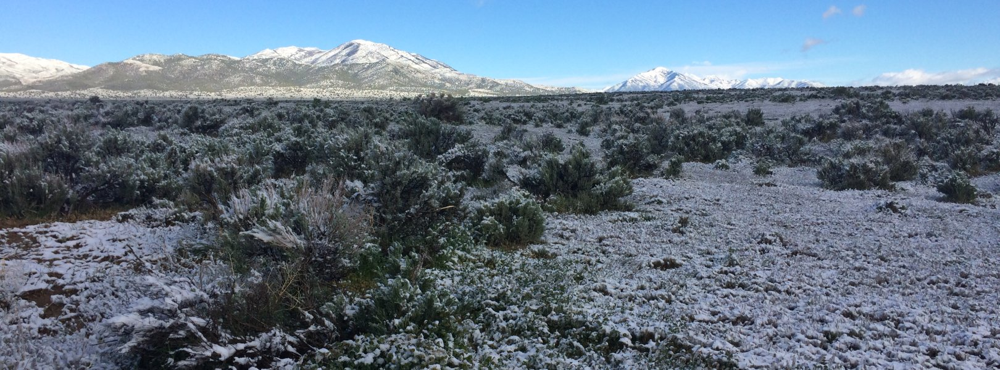

# Abstract

Different soil conditions give rise to different bacteria. This review aims to analyze NEON data in order to establish a more detailed understanding of a specific site and specific bacteria phylum. We discuss the different environments and conditions found at our site and explore the taxonomic breakdown of the site. We also break down our phylum into lower taxonomic groups and analyze what conditions these data points are found in. We highlight interesting findings concerning the relationship between soil pH and nutrient content and genome size. Ultimately this review aims to visualize NEON data and highlight interesting findings within our visualizations.

# Introduction

The Onaqui field site (ONAQ), managed by the Bureau of Land Management and located in Tooele County, Utah, is a significant terrestrial research area within the National Ecological Observatory Network (NEON), roughly 80 km southwest of Salt Lake City. Encompassing 68 km² of the Great Basin's characteristic sagebrush and juniper landscape, ONAQ operates within the arid, warm climate of the Great Basin Domain (D15), flanked by major American geographic features. The site's geology, dominated by Paleozoic deposits, supports diverse soil types and a unique hydrology within the Rush-Tooele Valleys Watershed. Vegetation primarily consists of Big Sagebrush, with areas of Utah Juniper and Pinyon Pine, providing habitat for a variety of fauna, including pronghorn, coyotes, and various small mammals. Historical uses of the land reflect a rich tapestry of indigenous habitation, agricultural development, and conflict, leading to its current multi-use management focused on conservation, recreation, and grazing. [@holthuijzen_grass-shrub_2015] [@baxter_great_2018]





Methylomirabilota, also known as the NC10 Phylum, is a bacterial phylum. These microbes possess a unique metabolic capability to perform anaerobic methane oxidation coupled to nitrite reduction (ANME-2d), a process known as anaerobic methane oxidation (AOM). This metabolic trait is distinctive because it allows them to thrive in environments with low to no oxygen availability, such as certain freshwater and marine sediments, where methane and nitrite coexist. [@he_novel_2016]

In this report, bacteria in the Methylomirabilota Phylum as well as organisms located at the Onaqui field site will be explored and patterns in both groups will be interpreted.

# Methods

NEON used multiple data collecting methods to receive the samples for each site as well as phylum. For each site the data was collected to report the weather, climate, land cover and species within the ecosystem. The 3 methods that were used for data collection was Airborne Remote Sensing, Automated Instruments and observational sampling. The Airborne Remote sensing used spectrometers, digital cameras, lidar, GPS and Inertial Measurement unit in order to observe data. The automated instruments were used to collect soil, surface water and groundwater to examine patterns as well as the bacteria found in these locations. Finally, observations were split into aquatic observations and terrestrial observations in which species diversity and environmental or chemical properties could be examined. The data was presented on the NEON website in which we were able to retrieve the data for our corresponding site and phylum. This specific data was then translated into a csv file so that it could successfully be imported into Rmarkdown. This is when the data could then be configured to represent different graphs and tables to present the data. This was done by asking site or phylum specific questions with respect to the data. The questions asked during this process are mentioned below.

```{r}
library(tidyverse)
library(plotly)
library(knitr)
library(DT)
```

```{r}
NEON_MAGs <- read_csv("data/NEON/GOLD_Study_ID_Gs0161344_NEON_edArchaea.csv") %>% 
  # remove columns that are not needed for data analysis
  select(-c(`GOLD Study ID`, `Bin Methods`, `Created By`, `Date Added`)) %>% 
  # create a new column with the Assembly Type
  mutate("Assembly Type" = case_when(`Genome Name` == "NEON combined assembly" ~ `Genome Name`,
                            TRUE ~ "Individual")) %>% 
  mutate_at("Assembly Type", str_replace, "NEON combined assembly", "Combined") %>% 
  separate(`GTDB-Tk Taxonomy Lineage`, c("Domain", "Phylum", "Class", "Order", "Family", "Genus"), "; ", remove = FALSE) %>% 
  # Get rid of the the common string "Soil microbial communities from "
  mutate_at("Genome Name", str_replace, "Terrestrial soil microbial communities from ", "") %>% 
  # Use the first `-` to split the column in two
  separate(`Genome Name`, c("Site","Sample Name"), " - ") %>% 
  # Get rid of the the common string "S-comp-1"
  mutate_at("Sample Name", str_replace, "-comp-1", "") %>%
  # separate the Sample Name into Site ID and plot info
  separate(`Sample Name`, c("Site ID","subplot.layer.date"), "_", remove = FALSE,) %>% 
  # separate the plot info into 3 columns
  separate(`subplot.layer.date`, c("Subplot", "Layer", "Date"), "-") 
```

```{r}
NEON_MAGs_bact_ind <- NEON_MAGs %>% 
  filter(Domain == "Bacteria") %>% 
  filter(`Assembly Type` == "Individual") 
```

```{r}
NEON_metagenomes <- read_tsv("data/NEON/exported_img_data_Gs0161344_NEON.tsv") %>% 
  rename(`Genome Name` = `Genome Name / Sample Name`) %>% 
  filter(str_detect(`Genome Name`, 're-annotation', negate = T)) %>% 
  filter(str_detect(`Genome Name`, 'WREF plot', negate = T)) 
```

```{r}
NEON_metagenomes <- NEON_metagenomes %>% 
  # Get rid of the the common string "Soil microbial communities from "
  mutate_at("Genome Name", str_replace, "Terrestrial soil microbial communities from ", "") %>% 
  # Use the first `-` to split the column in two
  separate(`Genome Name`, c("Site","Sample Name"), " - ") %>% 
  # Get rid of the the common string "-comp-1"
  mutate_at("Sample Name", str_replace, "-comp-1", "") %>%
  # separate the Sample Name into Site ID and plot info
  separate(`Sample Name`, c("Site ID","subplot.layer.date"), "_", remove = FALSE,) %>% 
  # separate the plot info into 3 columns
  separate(`subplot.layer.date`, c("Subplot", "Layer", "Date"), "-") 
```

```{r}
NEON_chemistry <- read_tsv("data/NEON/neon_plot_soilChem1_metadata.tsv") %>% 
  # remove -COMP from genomicsSampleID
  mutate_at("genomicsSampleID", str_replace, "-COMP", "") 
```

```{r}
kable(
  NEON_chemistry_description <- read_tsv("data/NEON/neon_soilChem1_metadata_descriptions.tsv") 
)
```

```{r}
NEON_MAGs_methyl<-NEON_MAGs_bact_ind%>%
filter(Phylum=="Methylomirabilota")
datatable(NEON_MAGs_methyl%>%
            count(Site, sort = TRUE))
```

# Results

## 1. What is the taxonomic breakdown of the Methylomirabilota Phylum?

As mentioned before, Methylomirabilota, or NC10, is a bacterial phylum. Within the NEON database, there are 23 collections of bacteria that belong to the Methylomirabilota phylum. Out of the 23 collections, 16 collections were collected by the Individual Assembly while 7 collections were from the NEON combined assembly. This lab will mostly focus on the 16 collections from the Individual Assembly.

As it can be seen within the Individual Assembly collections below, all 16 out of the 16 collections belong to the Class Methylomirabilia. However, when going deeper down into the taxonomy, 15 out of the 16 collections belong to the Order Rokubacteriales while 1 collection belongs to the Order Methylomirabilales. 

Looking at the breakdown of the families within the phylum, it has a similar pattern to the Order where 15 out of the 16 collections belong to the Family CSP1-6 while 1 collection belongs to the Order Methylmirabilales.

However, when looking at the Genus breakdown within the phylum, there are 5 genuses and 4 sets of novel bacterial genuses found with the Genus AR12 being the most present within the phylum.

Outside of the taxonomic breakdown, it can be seen that the Methylomirabilota Phylum was collected at 5 different NEON sites, with a majority of the collections at the National Grasslands LBJ and Konza Prairie Bio Station sites.


```{r, fig.width=8}
 NEON_MAGs_methyl %>% 
ggplot(aes(x = fct_rev(fct_infreq(Site)), fill = `Order`)) +
  geom_bar() +
  coord_flip() +
  labs(title = "Order at each Site", y = "Count", x = "Site")
```
#
```{r, fig.width=8}
 NEON_MAGs_methyl %>% 
ggplot(aes(x = fct_rev(fct_infreq(Site)), fill = `Class`)) +
  geom_bar() +
  coord_flip() +
  labs(title = "Order at each Site", y = "Count", x = "Site")
```

```{r, fig.width=8}
 NEON_MAGs_methyl %>% 
ggplot(aes(x = fct_rev(fct_infreq(Site)), fill = `Family`)) +
  geom_bar() +
  coord_flip() +
  labs(title = "Family at each Site", y = "Count", x = "Site")
```

```{r, fig.width=8}
 NEON_MAGs_methyl %>% 
ggplot(aes(x = fct_rev(fct_infreq(Site)), fill = `Genus`)) +
  geom_bar() +
  coord_flip() +
  labs(title = "Genus at each Site", y = "Count", x = "Site")
```

```{r}
   table_9<-NEON_metagenomes %>% 
  full_join(NEON_MAGs, by = "Sample Name")%>%
  full_join(NEON_chemistry, by = c("Sample Name" = "genomicsSampleID"))%>%
  filter(str_detect(`GTDB-Tk Taxonomy Lineage`,"Methylomirabilota"))
```

```{r}
table_10<-NEON_metagenomes %>% 
  full_join(NEON_MAGs, by = "Sample Name")%>%
  full_join(NEON_chemistry, by = c("Sample Name" = "genomicsSampleID"))
```

```{r, fig.height=8}
table_10%>%
  ggplot(aes(x=`Geographic Location`, fill=Phylum))+
  geom_bar()+
  theme(axis.text.x = element_text(angle=90, vjust=1, hjust=1))+
  labs(title = "Geographic Location for Methylomirabiota") 
```

## 2. What is the taxonomic breakdown at the site Onaqui?

Part of the NEON data is taken via soil samples. These soil samples are analyzed to determine which bacteria are present. We wanted to look at the taxonomic breakdown of bacteria at the site starting with Phylum and moving down to Family. When looking at the Phylums present, Actinobacteriota make up the majority of the bacteria present. In terms of classes present, the 4 biggest classes at the site are from this phylum. These 4 classes makeup the Actinobacteria phylum. When breaking down the taxonomy further, there are more orders within the phylum. At the family level a large portion of the Actinobacteria phylum lacks data regarding what family they belong to. When looking at specific subplots it can be seen that each subplot has a similar phylum and class makeup as the site data indicating that the taxonomic breakdown of the site is pretty uniform across the site.


```{r}
NEON_utah <- NEON_MAGs_bact_ind %>% 
  filter(Site=="Great Basin, Onaqui, Utah, USA")
```

```{r}
NEON_utah %>%
  ggplot(aes(x = fct_infreq(Phylum)))+
  geom_bar(aes(color = Phylum), position = position_dodge2(width = 0.9, preserve = "single"))+
  coord_flip()+
  labs(title="Phylum count at Onaqui", x ="Phylum", y="Count")
```

```{r}
NEON_utah %>%
  ggplot(aes(x = fct_infreq(Class)))+
  geom_bar(aes(color = Phylum), position = position_dodge2(width = 0.9, preserve = "single"))+
  coord_flip()+
  labs(title="Class count at Onaqui", x ="Phylum", y="Count")
```

```{r}
NEON_utah %>% 
ggplot(aes(x = fct_rev(fct_infreq(Phylum)), fill = `Class`)) +
  geom_bar() +
  coord_flip() +
  labs(title = "Class at each Phylum", y = "Count", x = "Phylum")
```

```{r, fig.width=8}
NEON_utah %>% 
ggplot(aes(x = fct_rev(fct_infreq(Phylum)), fill = `Order`)) +
  geom_bar() +
  coord_flip() +
  labs(title = "Order in Each Phylum", y = "Count", x = "Phylum")
```

```{r, fig.width=8}
NEON_utah %>% 
ggplot(aes(x = fct_rev(fct_infreq(Phylum)), fill = `Family`)) +
  geom_bar() +
  coord_flip() +
  labs(title = "Family in Each Phylum", y = "Count", x = "Phylum")
```

```{r}
NEON_utah %>% 
ggplot(aes(x = fct_rev(fct_infreq(Subplot)), fill = `Phylum`)) +
  geom_bar() +
  coord_flip() +
  labs(title = "Subplot MAG Counts", y = "Count", x = "Subplot")
```

```{r}
 NEON_utah %>% 
ggplot(aes(x = fct_rev(fct_infreq(Subplot)), fill = `Class`)) +
  geom_bar() +
  coord_flip() +
  labs(title = "Class Makeup at Each Subplot", y = "Count", x = "Subplot")
```

## 3. What effect does the environment have on Methylomirobiota?


Most bacteria that are similar to each other are usually found in similar environments. It can be said the same for Methylomirobiota. As it can be seen, most of the bacteria were found in a Grasslands subtype at temperatures greater than 17 degrees Celsius. Additionally, the 1 collection in the Order Methylomirabilales was found in a wetlands subtype at a temperature of 15 degrees Celsius.

```{r}
table_9%>%
ggplot(aes(x=fct_infreq(`Ecosystem Subtype`), y = soilTemp, color = Order))+
  geom_point()+
  coord_flip()+
  labs(title = "Ecosystem Subtype vs. Soil Temperature", x = "Ecosytem Subtype", y = "Soil Temperature") 
```

When analyzing the Soil pH in which the bacteria were found, it was found that 1 collection in the Order Methylomirabilales was at a pH of 7, which means that the soil was not acidic or basic, but neutral. Moreover, 2 collections in the Order Rokubacteriales found at the temperate forest areas were at pHs below 5, which means that the soil were acidic. Finally, 11 collections in the Order Rokubacteriales found at the grassland areas were at pHs that ranged from 4.5 to 7, which means that the soils at those areas were slightly acidic to neutral.

```{r, fig.width=8}
table_9%>%
ggplot(aes(x=soilInCaClpH, y = `Ecosystem Subtype`, color = Family))+
    geom_point()+
labs(title = "Soil pH", x = "CaCl Soil pH", y = "Ecosystem Subtype") 
```

In the Methylomirobiota phylum, collections were usually found at elevations under 1000 meters; however, one of the collections found in the temperate forest subtype was found at an elevation above 3000 meters. Additionally, the total number of bases as well as the total number of tRNA genes were not restricted to a small range. In fact, they were spread out and did not provide any unique properties in the phylum itself. Moreover, as seen below, soil temperature did not have any type of correlation with the total number of bases or the total number of tRNA genes. This meant that the environment did not influence the genetic sizes or gene amounts within the phylum itself.


```{r}
table_9%>%
  ggplot(aes(x=elevation, y=soilTemp, color=`Ecosystem Subtype`))+
  geom_point() +
  labs(title = "Elevation vs. Soil Temperature", x = "Elevation", y = "Soil Temperature")
```

```{r}
table_9%>%
  ggplot(aes(x=soilTemp, y=`Total Number of Bases`, color=Family))+
  geom_point()+
  labs(title = "Soil Temperature and Total Number of Bases", x = "Soil Temperature", y = "Total Number of Bases") 

```

```{r}
table_9%>%
  ggplot(aes(x=soilTemp, y=`tRNA Genes`, color=`Ecosystem Subtype`))+
  geom_point()+
  labs(title = "Soil Temperature and Total Number of tRNA Genes", x = "Soil Temperature", y = "tRNA Gene Count") 

```

```{r}
table_9%>%
  ggplot(aes(x=elevation, y=`Total Number of Bases`, color=`Ecosystem Subtype`))+
  geom_point()+
  labs(title = "Elevation and Total Number of Bases", x = "Elevation", y = "Total Number of Bases") 
```

```{r}
table_9%>%
  ggplot(aes(x=elevation, y=`tRNA Genes`, color=Genus))+
  geom_point()+
  labs(title = "Elevation and tRNA Gene Count", x = "Elevation", y = "tRNA Gene Count")
```

## 4. How does the environment vary between sites?

In looking at our site specific data we wanted to make comparisons across multiple sites. We looked primarily at two factors: soil temperature and soil pH. When compared to other sites, our site fell within the middle range of soil temperatures, ranging from 10 to 20 degrees celsius. The only sites that fell out of this middle range were the sites in Alaska with colder temperatures and the sites in Arizona and Puerto Rico with hotter temperatures. When comparing soil pH at sites, there was less data, but some interesting findings. Onaqui had higher pH than other sites, ranging from 8-9. The only site that had data points within this range was in Tuscon, Arizona, and even then there were data points with lower pH.

```{r}
table_10<-NEON_metagenomes %>% 
  full_join(NEON_MAGs, by = "Sample Name")%>%
  full_join(NEON_chemistry, by = c("Sample Name" = "genomicsSampleID"))
```

```{r, fig.height=8}
table_10%>%
ggplot(aes(x=fct_infreq(`Geographic Location`), y=soilTemp))+
  geom_boxplot()+
   theme(axis.text.x = element_text(angle=45, vjust=1, hjust=1))+
labs(title = "Site vs. Soil Temperature", x = "Geographic Location", y = "Soil Temperature") 
```

```{r, fig.height=10, fig.width=10}
table_10%>%
  ggplot(aes(x=Site.x, y=soilInWaterpH, color=Phylum))+
  geom_point()+
  theme(axis.text.x = element_text(angle=45, vjust=1, hjust=1))+
  labs(title = "Soil in Water pH at Sites", x = "Site", y = "Soil pH") 
```

## 5. How Does Soil Temperature Vary Between Sites

Research was conducted to determine how different the sites are in relation to their soil temperature and if Onaqui’s temperature was on an extreme. As seen below, the soil temperature found at Onaqui ranged at 11 to 16 degrees Celsius with its median temperature being 14.5 degrees Celsius. Compared to the other sites, Onaqui’s soil temperature was not found to be at an extreme, but a moderate temperature. This allows us to see that temperature was not a factor in bacterial collections.


```{r, fig.height=10, fig.width=10}
table_10%>%
  ggplot(aes(x=Site.x, y=soilTemp, color=Phylum))+
  geom_point()+
  theme(axis.text.x = element_text(angle=45, vjust=1, hjust=1))+
  labs(title = "Soil Temperature at Sites", x = "Site", y = "Soil Temp") 
```

```{r, fig.width=10, fig.height=10}
table_10%>%
ggplot(aes(x=fct_infreq(`Geographic Location`), y=soilTemp))+
  geom_boxplot()+
   theme(axis.text.x = element_text(angle=45, vjust=1, hjust=1))+
labs(title = "Site vs. Soil Temperature", x = "Geographic Location", y = "Soil Temperature") 
```

## 6. How Does Environment Affect Taxonomy?

Next we wanted to look at the role soil environment plays in overall taxonomy. When looking at soil temperature, most Phylums fall within the 10-20 degree celsius range. Actinobacteriota was mostly found in 15-20 degree celsius range. Methylomirabilota was found at similar temperatures, but had much less data points outside this range. In terms of pH, most phylums fell within the 5-7 range. Actinobacteria was found mainly at pHs of 5.5-7.5. Methylomirabilota ranged mainly from 6-7.

```{r, fig.height=10, fig.width=10}
table_10%>%
  ggplot(aes(x=soilTemp, y=soilInWaterpH, color=Phylum))+
  geom_point()+
  theme(axis.text.x = element_text(angle=45, vjust=1, hjust=1))+
  labs(title = "Soil Temperature and pH at Sites", x = "Soil Temperature", y = "Soil pH") 
```

```{r, fig.height=8, fig.width=8}
table_10%>%
  ggplot(aes(x=Phylum, y=soilTemp)) +
  geom_jitter(alpha = 0.3, color = "tomato")+
  geom_violin() +
  theme(axis.text.x = element_text(angle=90, vjust=1, hjust=1))+
  labs(title = "Soil Temperature for Phylums", x = "Phylums", y = "Soil Temp")
```

## 7. How Does Soil Affect tRNA Count

There are multiple factors that affect soil. Some explored in the graphs below include soil temperature, soil pH, elevation, nitrogen percent, and organic carbon percentage. Given these factors, one can reasonably assume that one of these might affect tRNA counts in the organisms found in the collections. However, the graphs below show that there is little to no correlation among these factors and its effect on the tRNA count of the organisms. This means that the soil in which the organisms survive is not influential to its tRNA amount.

```{r, fig.height=8}
table_10%>%
  ggplot(aes(x= `tRNA Genes`, y = soilTemp))+
  geom_point()+
  theme(axis.text.x = element_text(angle=90, vjust=1, hjust=1))+
  labs(title = "tRNA gene count vs. soil temp")
```

```{r, fig.height=8}
table_10%>%
  ggplot(aes(x= `tRNA Genes`, y = soilInCaClpH))+
  geom_point()+
  theme(axis.text.x = element_text(angle=90, vjust=1, hjust=1))+
  labs(title = "tRNA gene count vs. pH") 
```

```{r, fig.height=8}
table_10%>%
  ggplot(aes(x= `tRNA Genes`, y = elevation, color=`Ecosystem Subtype`))+
  geom_point()+
  theme(axis.text.x = element_text(angle=90, vjust=1, hjust=1))+
  labs(title = "tRNA gene count vs. elevation") 
```

```{r}
table_10%>%
  ggplot(aes(x= `tRNA Genes`, y = nitrogenPercent, color=`Ecosystem Subtype`))+
  geom_point()+
  theme(axis.text.x = element_text(angle=90, vjust=1, hjust=1))+
  labs(title = "tRNA gene count vs. nitrogen") 
```

```{r}
table_10%>%
  ggplot(aes(x= `tRNA Genes`, y = organicCPercent, color = `Ecosystem Subtype`))+
  geom_point(alpha=0.6)+
  theme(axis.text.x = element_text(angle=90, vjust=1, hjust=1))+
  labs(title = "tRNA gene count vs. organic C") 
```

```{r, fig.width=10, fig.height=10}
table_10%>%
ggplot(aes(x=fct_infreq(`Phylum`), y=`tRNA Genes`))+
  geom_boxplot()+
   theme(axis.text.x = element_text(angle=45, vjust=1, hjust=1))+
labs(title = "Site vs. Soil Temperature", x = "Geographic Location", y = "Soil Temperature") 
```

## 8. Tree Visualizations
We wanted to visualize both the tree visualization of our phylum and at our site. At our site a few interesting things were found. For the most part genome size is relatively similar between different genus within the same family. One data point in particular stood out. The sample taken from the wetland shows that the species isn’t closely related to any of the other species within the phylum. This is interesting as it is the only species found in the wetland ecosystem amongst NEON samples.

```{r}
if (!require("BiocManager", quietly = TRUE))
    install.packages("BiocManager")

BiocManager::install("treeio")
BiocManager::install("ggtreeExtra")
```

```{r}
library(tidyverse)
library(knitr)
library(ggtree)
library(TDbook) #A Companion Package for the Book "Data Integration, Manipulation and Visualization of Phylogenetic Trees" by Guangchuang Yu (2022, ISBN:9781032233574).
library(ggimage)
library(rphylopic)
library(treeio)
library(tidytree)
library(ape)
library(TreeTools)
library(phytools)
library(ggnewscale)
library(ggtreeExtra)
library(ggstar)
```

```{r}
tree_arc <- read.tree("data/NEON/gtdbtk.ar53.decorated.tree")
tree_bac <- read.tree("data/NEON/gtdbtk.bac120.decorated.tree")
```

```{r}
tree_bac_preorder <- Preorder(tree_bac)
tree_Methyl <- Subtree(tree_bac_preorder, 2651)
```

```{r}
NEON_MAGs_metagenomes_chemistry <- NEON_MAGs %>% 
  left_join(NEON_metagenomes, by = "Sample Name") %>% 
  left_join(NEON_chemistry, by = c("Sample Name" = "genomicsSampleID")) %>% 
  rename("label" = "Bin ID")
```

```{r}
NEON_MAGs_Methyl <- NEON_MAGs_metagenomes_chemistry %>% 
  filter(Phylum == "Methylomirabilota") 
```

```{r}
ggtree(tree_Methyl, layout="circular")  %<+%
  NEON_MAGs_metagenomes_chemistry + 
  geom_point2(mapping=aes(color=`Ecosystem Subtype`, size=`Total Number of Bases`))
```

## 9. At Site

Below, the phylogeny of the organisms found at Onaqui are shown. As it seen, the phylogeny is normal as organisms found in the same phylum are close to each other in the phylogeny. However, organisms that are too similar to each other in the phylogeny are found at different ecosystem subtypes

```{r}
# For unknown reasons the following does not like blank spaces in the names
NEON_MAGs_metagenomes_chemistry_noblank <- NEON_MAGs_metagenomes_chemistry %>% 
  rename("AssemblyType" = "Assembly Type") %>% 
  rename("BinCompleteness" = "Bin Completeness") %>% 
  rename("BinContamination" = "Bin Contamination") %>% 
  rename("TotalNumberofBases" = "Total Number of Bases") %>% 
  rename("EcosystemSubtype" = "Ecosystem Subtype")

ggtree(tree_Methyl)  %<+%
  NEON_MAGs_metagenomes_chemistry + 
  geom_tippoint(aes(colour=`Ecosystem Subtype`)) + 

# For unknown reasons the following does not like blank spaces in the names
  geom_facet(panel = "Bin Completeness", data = NEON_MAGs_metagenomes_chemistry_noblank, geom = geom_point, 
      mapping=aes(x = BinCompleteness)) +
  geom_facet(panel = "Bin Contamination", data = NEON_MAGs_metagenomes_chemistry_noblank, geom = geom_col, 
                aes(x = BinContamination), orientation = 'y', width = .6) +
  theme_tree2(legend.position=c(.1, .7))
```

```{r}
NEON_MAGs_metagenomes_chemistry_ONAQ <- NEON_MAGs_metagenomes_chemistry %>% 
  filter(`Site ID.x` == "ONAQ")
```

```{r}
NEON_MAGs_metagenomes_chemistry_ONAQ <- NEON_MAGs_metagenomes_chemistry %>% 
  filter(`Site ID.x` == "ONAQ") %>% 
  filter(Domain.x == "Bacteria")
```

```{r}
ONAQ_MAGs_label <- NEON_MAGs_metagenomes_chemistry_ONAQ$label
```

```{r}
tree_bac_ONAQ_MAGs <-drop.tip(tree_bac,tree_bac$tip.label[-match(ONAQ_MAGs_label, tree_bac$tip.label)])
```

```{r}
ggtree(tree_bac_ONAQ_MAGs, layout="circular")  %<+%
  NEON_MAGs_metagenomes_chemistry +
  geom_point(mapping=aes(color=Phylum)) 
```

## 10. Sankey

```{r}
NEON_MAGs_ind <- NEON_MAGs %>% 
  filter(`Assembly Type` == "Individual") 
```

```{r}
NEON_MAGs_co <- NEON_MAGs %>% 
  filter(`Assembly Type` == "Combined") 
```

```{r}
# Select the GTDB Taxonomic lineage and separate into taxonomic levels
sankey_data <- NEON_MAGs_co %>% 
  select(`GTDB-Tk Taxonomy Lineage`) %>% 
  # NAs are likely Archaea
  replace_na(list(`GTDB-Tk Taxonomy Lineage` = 'Archaea')) %>% 
  # Pavian format requires p__ etc
  separate(`GTDB-Tk Taxonomy Lineage`, c("Domain", "Phylum", "Class", "Order", "Family", "Genus", "Species"), "; ") 
```

```{r}
# Fill in the NAs with the taxonomic the higher taxonomic level to the left
sankey_data[] <- t(apply(sankey_data, 1, zoo::na.locf))

# Put the data into a format that can be read by the Sankey App

sankey_data <- sankey_data %>% 
  unite(col = "classification", c(Domain, Phylum, Class, Order, Family, Genus, Species), sep='; ') %>% 
  mutate_at("classification", str_replace, "Archaea", "d__Archaea") %>% 
  mutate_at("classification", str_replace, "Bacteria", "d__Bacteria") %>%  
  mutate_at("classification", str_replace, "; ", "|p__") %>% 
  mutate_at("classification", str_replace, "; ", "|c__") %>% 
  mutate_at("classification", str_replace, "; ", "|o__") %>% 
  mutate_at("classification", str_replace, "; ", "|f__") %>% 
  mutate_at("classification", str_replace, "; ", "|g__") %>% 
  mutate_at("classification", str_replace, "; ", "|s__")  

# Create format for Pavian with counts for each taxonomic level
sankey_data_s <- sankey_data
sankey_data_g <- sankey_data
sankey_data_f <- sankey_data
sankey_data_o <- sankey_data
sankey_data_c <- sankey_data
sankey_data_p <- sankey_data
sankey_data_d <- sankey_data

sankey_data_g$classification <- sub("\\|s__.*", "", sankey_data_g$classification)  
sankey_data_f$classification <- sub("\\|g__.*", "", sankey_data_f$classification)  
sankey_data_o$classification <- sub("\\|f__.*", "", sankey_data_o$classification)  
sankey_data_c$classification <- sub("\\|o__.*", "", sankey_data_c$classification)  
sankey_data_p$classification <- sub("\\|c__.*", "", sankey_data_p$classification)  
sankey_data_d$classification <- sub("\\|p__.*", "", sankey_data_d$classification)  

sankey_data_allTaxa <- bind_rows(sankey_data_s, sankey_data_g, sankey_data_f, sankey_data_o, sankey_data_c, sankey_data_p, sankey_data_d) %>% 
  mutate(classification = as.factor(classification)) %>% 
  count(classification) %>% 
# rename for Pavian format
  rename(`#SampleID` = `classification`) %>% 
  rename(`Metaphlan2_Analysis` = `n`) 

# Write file to input to Pavian Sankey
write_tsv(sankey_data_allTaxa, "NEON_MAG_co_pavian.txt")
```


```{r}
NEON_MAGs_ind_Methylo <- NEON_MAGs %>% 
  filter(Domain == "Bacteria") %>% 
  filter(`Assembly Type` == "Individual") %>%
  filter(Phylum == "Methylomirabilota")
```

```{r}
# Select the GTDB Taxonomic lineage and separate into taxonomic levels
sankey_data_exer1 <- NEON_MAGs_ind_Methylo %>% 
  select(`GTDB-Tk Taxonomy Lineage`) %>% 
  # NAs are likely Archaea
  replace_na(list(`GTDB-Tk Taxonomy Lineage` = 'Archaea')) %>% 
  # Pavian format requires p__ etc
  separate(`GTDB-Tk Taxonomy Lineage`, c("Domain", "Phylum", "Class", "Order", "Family", "Genus", "Species"), "; ") 
```

```{r}
# Fill in the NAs with the taxonomic the higher taxonomic level to the left
sankey_data_exer1[] <- t(apply(sankey_data_exer1, 1, zoo::na.locf))

# Put the data into a format that can be read by the Sankey App

sankey_data_exer1 <- sankey_data_exer1 %>% 
  unite(col = "classification", c(Domain, Phylum, Class, Order, Family, Genus, Species), sep='; ') %>% 
  mutate_at("classification", str_replace, "Archaea", "d__Archaea") %>% 
  mutate_at("classification", str_replace, "Bacteria", "d__Bacteria") %>%  
  mutate_at("classification", str_replace, "; ", "|p__") %>% 
  mutate_at("classification", str_replace, "; ", "|c__") %>% 
  mutate_at("classification", str_replace, "; ", "|o__") %>% 
  mutate_at("classification", str_replace, "; ", "|f__") %>% 
  mutate_at("classification", str_replace, "; ", "|g__") %>% 
  mutate_at("classification", str_replace, "; ", "|s__")  

# Create format for Pavian with counts for each taxonomic level
sankey_data_exer1_s <- sankey_data_exer1
sankey_data_exer1_g <- sankey_data_exer1
sankey_data_exer1_f <- sankey_data_exer1
sankey_data_exer1_o <- sankey_data_exer1
sankey_data_exer1_c <- sankey_data_exer1
sankey_data_exer1_p <- sankey_data_exer1
sankey_data_exer1_d <- sankey_data_exer1

sankey_data_exer1_g$classification <- sub("\\|s__.*", "", sankey_data_exer1_g$classification)  
sankey_data_exer1_f$classification <- sub("\\|g__.*", "", sankey_data_exer1_f$classification)  
sankey_data_exer1_o$classification <- sub("\\|f__.*", "", sankey_data_exer1_o$classification)  
sankey_data_exer1_c$classification <- sub("\\|o__.*", "", sankey_data_exer1_c$classification)  
sankey_data_exer1_p$classification <- sub("\\|c__.*", "", sankey_data_exer1_p$classification)  
sankey_data_exer1_d$classification <- sub("\\|p__.*", "", sankey_data_exer1_d$classification)  

sankey_data_exer1_allTaxa <- bind_rows(sankey_data_exer1_s, sankey_data_exer1_g, sankey_data_exer1_f, sankey_data_exer1_o, sankey_data_exer1_c, sankey_data_exer1_p, sankey_data_exer1_d) %>% 
  mutate(classification = as.factor(classification)) %>% 
  count(classification) %>% 
# rename for Pavian format
  rename(`#SampleID` = `classification`) %>% 
  rename(`Metaphlan2_Analysis` = `n`) 

# Write file to input to Pavian Sankey
write_tsv(sankey_data_exer1_allTaxa, "NEON_MAG_exer1_pavian.txt")
```

```{r}
knitr::include_url("images/lab14/sankey-NEON_MAG_exer1_pavian.txt.html")
```

Here, we have the Sankey plot for the individual assemblies for Methylomirabilota at all sites.

```{r}
NEON_MAGs_com_Methylo <- NEON_MAGs %>% 
  filter(Domain == "Bacteria") %>% 
  filter(`Assembly Type` == "Combined") %>%
  filter(Phylum == "Methylomirabilota")
```

```{r}
# Select the GTDB Taxonomic lineage and separate into taxonomic levels
sankey_data_exer2 <- NEON_MAGs_com_Methylo %>% 
  select(`GTDB-Tk Taxonomy Lineage`) %>% 
  # NAs are likely Archaea
  replace_na(list(`GTDB-Tk Taxonomy Lineage` = 'Archaea')) %>% 
  # Pavian format requires p__ etc
  separate(`GTDB-Tk Taxonomy Lineage`, c("Domain", "Phylum", "Class", "Order", "Family", "Genus", "Species"), "; ") 
```

```{r}
# Fill in the NAs with the taxonomic the higher taxonomic level to the left
sankey_data_exer2[] <- t(apply(sankey_data_exer2, 1, zoo::na.locf))

# Put the data into a format that can be read by the Sankey App

sankey_data_exer2 <- sankey_data_exer2 %>% 
  unite(col = "classification", c(Domain, Phylum, Class, Order, Family, Genus, Species), sep='; ') %>% 
  mutate_at("classification", str_replace, "Archaea", "d__Archaea") %>% 
  mutate_at("classification", str_replace, "Bacteria", "d__Bacteria") %>%  
  mutate_at("classification", str_replace, "; ", "|p__") %>% 
  mutate_at("classification", str_replace, "; ", "|c__") %>% 
  mutate_at("classification", str_replace, "; ", "|o__") %>% 
  mutate_at("classification", str_replace, "; ", "|f__") %>% 
  mutate_at("classification", str_replace, "; ", "|g__") %>% 
  mutate_at("classification", str_replace, "; ", "|s__")  

# Create format for Pavian with counts for each taxonomic level
sankey_data_exer2_s <- sankey_data_exer2
sankey_data_exer2_g <- sankey_data_exer2
sankey_data_exer2_f <- sankey_data_exer2
sankey_data_exer2_o <- sankey_data_exer2
sankey_data_exer2_c <- sankey_data_exer2
sankey_data_exer2_p <- sankey_data_exer2
sankey_data_exer2_d <- sankey_data_exer2

sankey_data_exer2_g$classification <- sub("\\|s__.*", "", sankey_data_exer2_g$classification)  
sankey_data_exer2_f$classification <- sub("\\|g__.*", "", sankey_data_exer2_f$classification)  
sankey_data_exer2_o$classification <- sub("\\|f__.*", "", sankey_data_exer2_o$classification)  
sankey_data_exer2_c$classification <- sub("\\|o__.*", "", sankey_data_exer2_c$classification)  
sankey_data_exer2_p$classification <- sub("\\|c__.*", "", sankey_data_exer2_p$classification)  
sankey_data_exer2_d$classification <- sub("\\|p__.*", "", sankey_data_exer2_d$classification)  

sankey_data_exer2_allTaxa <- bind_rows(sankey_data_exer2_s, sankey_data_exer2_g, sankey_data_exer2_f, sankey_data_exer2_o, sankey_data_exer2_c, sankey_data_exer2_p, sankey_data_exer2_d) %>% 
  mutate(classification = as.factor(classification)) %>% 
  count(classification) %>% 
# rename for Pavian format
  rename(`#SampleID` = `classification`) %>% 
  rename(`Metaphlan2_Analysis` = `n`) 

# Write file to input to Pavian Sankey
write_tsv(sankey_data_exer2_allTaxa, "NEON_MAG_exer2_pavian.txt")
```

```{r}
knitr::include_url("images/lab14/sankey-NEON_MAG_exer2_pavian.txt.html")
```
Here, we have the Sankey plot for the combined assemblies in the Methylomirabilota phylum.

```{r}
NEON_MAGs_ONAQ <- NEON_MAGs %>% 
  filter(Site == "Great Basin, Onaqui, Utah, USA")
```

```{r}
# Select the GTDB Taxonomic lineage and separate into taxonomic levels
sankey_data_exer3 <- NEON_MAGs_ONAQ %>% 
  select(`GTDB-Tk Taxonomy Lineage`) %>% 
  # NAs are likely Archaea
  replace_na(list(`GTDB-Tk Taxonomy Lineage` = 'Archaea')) %>% 
  # Pavian format requires p__ etc
  separate(`GTDB-Tk Taxonomy Lineage`, c("Domain", "Phylum", "Class", "Order", "Family", "Genus", "Species"), "; ") 
```

```{r}
# Fill in the NAs with the taxonomic the higher taxonomic level to the left
sankey_data_exer3[] <- t(apply(sankey_data_exer3, 1, zoo::na.locf))

# Put the data into a format that can be read by the Sankey App

sankey_data_exer3 <- sankey_data_exer3 %>% 
  unite(col = "classification", c(Domain, Phylum, Class, Order, Family, Genus, Species), sep='; ') %>% 
  mutate_at("classification", str_replace, "Archaea", "d__Archaea") %>% 
  mutate_at("classification", str_replace, "Bacteria", "d__Bacteria") %>%  
  mutate_at("classification", str_replace, "; ", "|p__") %>% 
  mutate_at("classification", str_replace, "; ", "|c__") %>% 
  mutate_at("classification", str_replace, "; ", "|o__") %>% 
  mutate_at("classification", str_replace, "; ", "|f__") %>% 
  mutate_at("classification", str_replace, "; ", "|g__") %>% 
  mutate_at("classification", str_replace, "; ", "|s__")  

# Create format for Pavian with counts for each taxonomic level
sankey_data_exer3_s <- sankey_data_exer3
sankey_data_exer3_g <- sankey_data_exer3
sankey_data_exer3_f <- sankey_data_exer3
sankey_data_exer3_o <- sankey_data_exer3
sankey_data_exer3_c <- sankey_data_exer3
sankey_data_exer3_p <- sankey_data_exer3
sankey_data_exer3_d <- sankey_data_exer3

sankey_data_exer3_g$classification <- sub("\\|s__.*", "", sankey_data_exer3_g$classification)  
sankey_data_exer3_f$classification <- sub("\\|g__.*", "", sankey_data_exer3_f$classification)  
sankey_data_exer3_o$classification <- sub("\\|f__.*", "", sankey_data_exer3_o$classification)  
sankey_data_exer3_c$classification <- sub("\\|o__.*", "", sankey_data_exer3_c$classification)  
sankey_data_exer3_p$classification <- sub("\\|c__.*", "", sankey_data_exer3_p$classification)  
sankey_data_exer3_d$classification <- sub("\\|p__.*", "", sankey_data_exer3_d$classification)  

sankey_data_exer3_allTaxa <- bind_rows(sankey_data_exer3_s, sankey_data_exer3_g, sankey_data_exer3_f, sankey_data_exer3_o, sankey_data_exer3_c, sankey_data_exer3_p, sankey_data_exer3_d) %>% 
  mutate(classification = as.factor(classification)) %>% 
  count(classification) %>% 
# rename for Pavian format
  rename(`#SampleID` = `classification`) %>% 
  rename(`Metaphlan2_Analysis` = `n`) 

# Write file to input to Pavian Sankey
write_tsv(sankey_data_exer3_allTaxa, "NEON_MAG_exer3_pavian.txt")
```

```{r}
knitr::include_url("images/lab14/sankey-NEON_MAG_exer3_pavian.txt.html")
```

Here, we have the Sankey plot for the Onaqui Site.


# Discussion
Our site, Onaqui basin, Utah showed to have environmental properties that put it in the middle range of soil temperature. When it came to pH, Onaqui was more alkaline than the other sites. This aligns with shrubland conditions which generally have higher pH and low nutrient content. In terms of taxonomic breakdown at the site, a vast majority of bacteria fell into the actinobacteria phylum. Considering this was the most common phylum across the phylums in the NEON data, this data makes sense. 

Our Phylum, Methylomirbilota, is less common than other phylums. The phylum stuck to a small range of temperatures and pH. Taxonomically, there were few classes and orders. From the data it would appear to be a small phylum. Amongst specific data points, one data point stood out as interesting. Typically the phylum would appear in grasslands, shrubland or temperate forest, one data point was found in wetlands. One interesting finding was that the most of the collections that were done on organisms in the phylum were found at elevations below 1000 meters while the only one was found at an elevation near 3000 meters, which was the wetlands collection. This data point was genetically distant from the other data points, probably resulting in its ability to survive in an environment this phylum wouldn’t be expected to be found at.

# References


